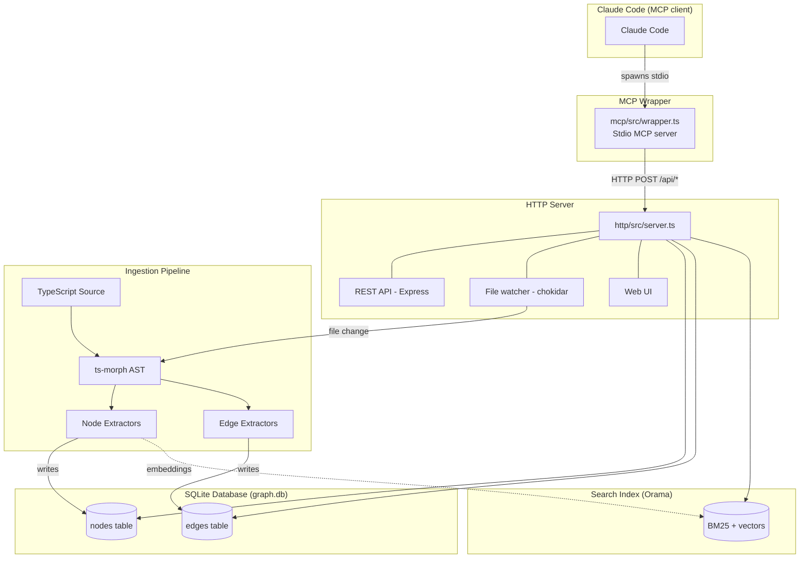
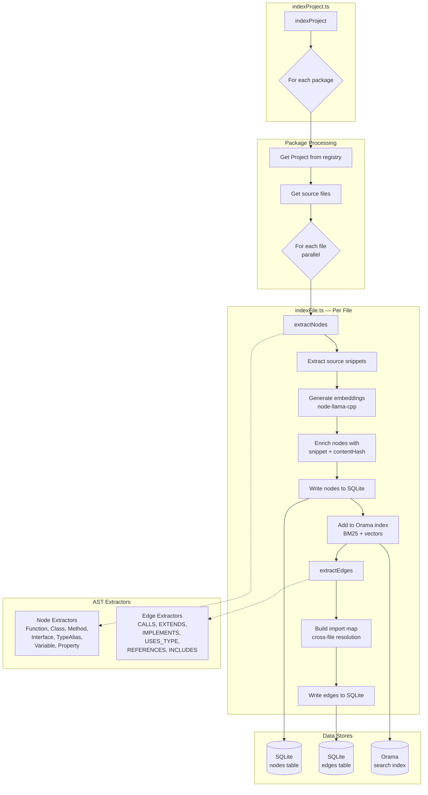

# Architecture

ts-graph is an MCP server that extracts TypeScript code structure into a
queryable graph database.

## Overview

Single package with two modes:

| Command                  | Mode        | Purpose                          |
| ------------------------ | ----------- | -------------------------------- |
| `npx ts-graph-mcp`       | HTTP server | Indexing + HTTP API + Web UI     |
| `npx ts-graph-mcp --mcp` | MCP wrapper | Stdio MCP server for Claude Code |

The MCP wrapper expects the HTTP server to be running separately.

## High-Level Architecture



## Project Structure

Monorepo with 4 internal workspace packages:

```
ts-graph-mcp/
├── http/                        # @ts-graph/http (internal)
│   └── src/
│       ├── server.ts            # HTTP server entry point
│       ├── config/              # Configuration loading
│       ├── db/                  # Database abstraction
│       ├── ingestion/           # AST extraction pipeline
│       └── query/               # Tool implementations
├── mcp/                         # @ts-graph/mcp (internal)
│   └── src/
│       └── wrapper.ts           # MCP stdio wrapper
├── shared/                      # @ts-graph/shared (internal)
│   └── src/
│       └── index.ts             # Shared types
├── ui/                          # @ts-graph/ui (internal)
│   └── src/                     # React SPA (Vite build)
├── main.ts                      # Entry point (--mcp flag dispatch)
└── package.json                 # Root: ts-graph-mcp (published)
```

- `http/` and `mcp/` are parallel — both are "servers", named by protocol
- `shared/` contains types/interfaces used by all packages
- `ui/` is a React SPA with its own Vite build
- Only root `ts-graph-mcp` is published; internal packages use `@ts-graph/*`
  imports

## Server Discovery

The MCP wrapper finds the HTTP server using this priority:

1. **Config file:** `ts-graph-mcp.config.json` → `server.port` (required)
2. **Environment variable:** `TS_GRAPH_URL` (optional override)

The port must be configured in `ts-graph-mcp.config.json`. There is no default
port.

## HTTP API

### Health Check

```
GET /health

Response:
{ "status": "ok", "ready": true, "indexed_files": 142 }
```

### Symbol Search (for autocomplete)

```
GET /api/symbols?q=format

Response:
[
  { "file_path": "src/utils.ts", "symbol": "formatDate", "type": "Function" },
  { "file_path": "src/utils.ts", "symbol": "formatNumber", "type": "Function" }
]
```

### Graph Search

Unified endpoint for all graph queries:

```
POST /api/graph/search
Content-Type: application/json

{
  "topic": "validation",           // Semantic search (optional)
  "from": { "symbol": "handleRequest", "file_path": "src/api.ts" },
  "to": { "symbol": "saveData", "file_path": "src/db.ts" },
  "max_nodes": 50,
  "format": "mcp",                 // "mcp" (default) or "mermaid"
  "direction": "LR"                // Optional: "LR" or "TD" (mermaid only)
}

Response:
{ "result": "## Graph\n\nhandleRequest --CALLS--> ..." }
```

Query patterns:

- `{ from: { symbol } }` — Forward traversal (dependencies)
- `{ to: { symbol } }` — Backward traversal (dependents)
- `{ from, to }` — Path finding
- `{ topic }` — Semantic search (hybrid BM25 + vector)

## Data Model

See `http/src/db/Types.ts` for node and edge type definitions.

**Node ID format**: `{filePath}:{symbolPath}` — e.g., `src/utils.ts:formatDate`,
`src/models/User.ts:User.save`

### Edge Types

| Edge           | Description                                 |
| -------------- | ------------------------------------------- |
| `CALLS`        | Direct function/method invocation           |
| `INCLUDES`     | JSX component usage (`<Component />`)       |
| `EXTENDS`      | Class/interface inheritance                 |
| `IMPLEMENTS`   | Class implements interface                  |
| `TAKES`        | Function/method parameter type              |
| `RETURNS`      | Function/method return type                 |
| `HAS_TYPE`     | Variable type annotation                    |
| `HAS_PROPERTY` | Class/interface/object property type        |
| `DERIVES_FROM` | Type alias composition (intersection/union) |
| `ALIAS_FOR`    | Direct type alias                           |
| `REFERENCES`   | Function passed as callback or stored       |

### Type Signature Edge Design

Type edges capture data flow and polymorphism:

- **Generics**: Extract inner type only (`Promise<User>` → edge to `User`)
- **Unions**: Multiple edges (`User | Admin` → edges to both, skip
  `null`/`undefined`)
- **Primitives**: Skipped (`string`, `number`, `boolean`, etc.)
- **Built-ins**: Skipped (`Array`, `Promise`, `Map`, etc.) — inner types
  extracted

### Transparent Re-exports

**Re-exports are completely invisible in the graph.** No nodes, no edges,
nothing.

When file X imports from a barrel file and calls a function:

```typescript
// X.ts
import { formatValue } from "./index"; // barrel re-exports from helper.ts
formatValue();
```

The graph shows: `X.ts --CALLS--> src/utils/helper.ts:formatValue`

**NOT:** `X.ts --CALLS--> src/index.ts:...` (barrel file is invisible)

This is achieved at **indexing time**:

- `buildImportMap.ts` follows re-export chains using `followAliasChain()`
- Edges point directly to actual definitions
- Barrel files with only re-exports have no symbol nodes

No query-time resolution needed. The graph only contains actual code
definitions.

## Data Flow

### Indexing Pipeline



Streaming architecture — processes one file at a time:

1. **Extract Nodes** from AST → extract snippets → generate embeddings → enrich
   with snippet + contentHash → write to DB → add to search index
2. **Extract Edges** using import map for cross-file resolution → write to DB

Memory efficient: O(1) per file, scales to any codebase size.

### Cross-File Resolution

Edge extractors use `buildImportMap` to resolve cross-file references:

- ts-morph resolves import paths (handles tsconfig `paths` aliases like
  `@shared/*`)
- Workspace map resolves cross-package imports in monorepos
- Import map constructs target IDs: `{targetPath}:{symbolName}`
- No need to validate target exists — queries use JOINs to filter dangling edges

### Workspace Resolution

For monorepos with multiple packages, ts-graph builds a **workspace map** at
project creation time that maps package names directly to source entry files:

```
"@libs/toolkit" → "/path/to/libs/toolkit/src/index.ts"
"@app/shared"   → "/path/to/app/shared/src/index.ts"
```

**Why not use package manager resolution (PnP, node_modules)?**

Package managers resolve to compiled output (`dist/index.js`). This tool
analyzes **source code** — it should never require `dist/` folders to exist.

**How it works** (`buildWorkspaceMap.ts`):

1. Parse root `package.json` workspaces field (supports globs like `libs/*`)
2. For each package, read its `package.json` to get the npm package name
3. Infer source entry from `main` + tsconfig `outDir`/`rootDir` mapping
4. Build map: `packageName → absoluteSourcePath`

**Resolution order** in `createProject.ts`:

1. Check workspace map for exact package name match
2. Fall back to standard TypeScript resolution (relative imports, external
   packages)

### No Foreign Key Constraints

The schema omits FK constraints intentionally:

1. Queries JOIN with nodes table, automatically filtering dangling edges
2. Backend-agnostic (graph databases don't use FK constraints)
3. Enables parallel indexing of packages

## MCP Tool: searchGraph

One unified tool for all graph queries:

| Query Pattern       | Input                  | Question                                   |
| ------------------- | ---------------------- | ------------------------------------------ |
| Forward traversal   | `{ from: { symbol } }` | "What does this depend on?"                |
| Backward traversal  | `{ to: { symbol } }`   | "Who depends on this?"                     |
| Path finding        | `{ from, to }`         | "How does A reach B?"                      |
| Semantic search     | `{ topic }`            | "Find code related to X"                   |

See [`http/src/query/CLAUDE.md`](http/src/query/CLAUDE.md) for implementation
details.

### Parameters

**`from` / `to`** (GraphEndpoint): Each can specify:

- `symbol` — Exact symbol name
- `query` — Natural language (uses semantic search)
- `file_path` — Include when known to avoid disambiguation

**`topic`** (optional): Standalone semantic search (e.g., "validation",
"authentication"). Not combinable with `from`/`to`.

**`max_nodes`** (optional, default: 50): Controls output size. Output adapts
based on node count:

- **1-30 nodes**: Full output with snippets
- **31+ nodes**: Metadata only (snippets omitted to reduce noise)

When the graph exceeds `max_nodes`, it is truncated to the first `max_nodes`
nodes in BFS order. The Nodes section is always included for the kept nodes.

### Symbol Resolution

When a symbol isn't found at the exact path:

1. **Method name matching** — Searches for method names across all classes
2. **Single match** — Auto-resolves and proceeds (output shows resolved name)
3. **Multiple matches** — Returns disambiguation list with file paths

### Output Format

```
## Graph

fnA --CALLS--> fnB --CALLS--> fnC

## Nodes

fnB:
  type: Function
  file: src/b.ts
  offset: 1, limit: 3
  snippet:
    1: function fnB() {
  > 2:   return fnC();
    3: }
```

### Design Philosophy

**Lean definitions.** Tool definitions appear in every conversation (fixed token
cost), so keep them as concise as possible yet providing all the crucial
information and making sure the AI agent will call them when it's the efficient
solution.

## LSP Overlap

Claude Code has a built-in LSP tool. Use each for its strengths:

| LSP                                      | ts-graph                             |
| ---------------------------------------- | ------------------------------------ |
| Real-time, no indexing lag               | Pre-indexed, instant complex queries |
| Point-to-point (definition, direct refs) | Transitive (callers of callers)      |
| Single function context                  | Path finding (A → B)                 |

## File Watching

The server automatically reindexes files on save:

1. **Startup sync** — Compares manifest (mtime/size) with filesystem, reindexes
   stale/new files
2. **Runtime watcher** — Chokidar watches for changes, debounces rapid saves
   (300ms default)
3. **tsconfig validation** — Only files in tsconfig compilation are indexed (not
   just any `.ts` file)

**Key files:**

- `http/src/ingestion/watchProject.ts` — Chokidar watcher with debouncing
- `http/src/ingestion/syncOnStartup.ts` — Manifest-based startup sync
- `http/src/ingestion/manifest.ts` — Tracks indexed files (mtime/size)
- `http/src/ingestion/indexFile.ts` — Shared extraction function

Watch options can be read from `tsconfig.json` `watchOptions` as defaults. See
README for configuration reference.

## Web UI

Single-page application served at the root URL.

### Layout

```
┌─────────────────────────────────────────────────────────────────┐
│  [START node ▼] [×]      [END node ▼] [×]                       │
├─────────────────────────────────────────────────────────────────┤
│  [ MCP ] [ Mermaid ] [ Markdown ]                               │
├─────────────────────────────────────────────────────────────────┤
│                                                                 │
│  (output display area)                                          │
│                                                                 │
└─────────────────────────────────────────────────────────────────┘
```

### Behavior

| Selection             | Query        | Display                   |
| --------------------- | ------------ | ------------------------- |
| 0 nodes               | —            | Empty / instructions      |
| 1 node (START only)   | dependentsOf | Who depends on this?      |
| 2 nodes (START + END) | pathsBetween | How does START reach END? |

Both select inputs use fuzzy search against `/api/symbols?q=...` endpoint.

## Limitations

1. **SQLite only** — Query logic uses direct SQL. DbWriter interface exists for
   writes only.
2. **No config watching** — Changes to tsconfig.json or package.json workspaces
   require server restart.
3. **Base package imports only** — Workspace resolution handles `@libs/toolkit`
   but not subpath imports like `@libs/toolkit/helpers` (would require `exports`
   field parsing).
