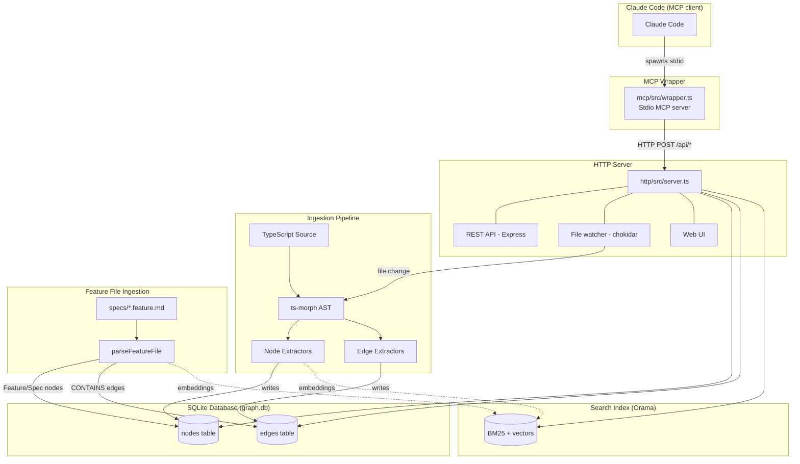
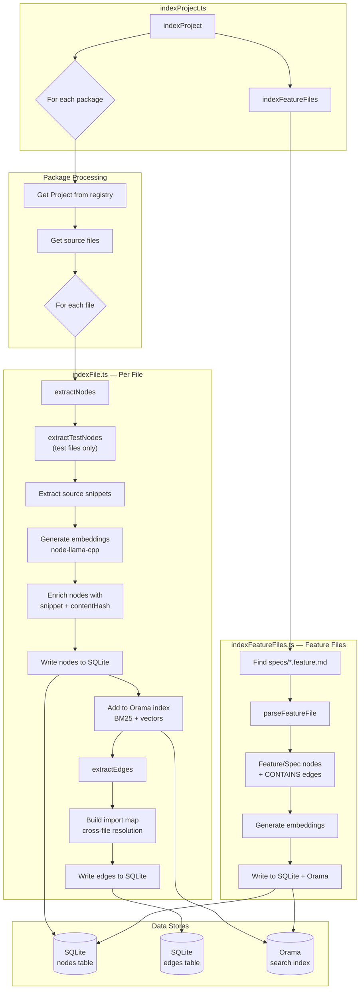

# Architecture

ts-graph is an MCP server that extracts TypeScript code structure into a
queryable graph database.

For behavioral specifications (what the system does, input/output contracts),
see `specs/`.

## Overview

Single package with two modes:

| Command                  | Mode        | Purpose                          |
| ------------------------ | ----------- | -------------------------------- |
| `npx ts-graph-mcp`       | HTTP server | Indexing + HTTP API + Web UI     |
| `npx ts-graph-mcp --mcp` | MCP wrapper | Stdio MCP server for Claude Code |

The MCP wrapper expects the HTTP server to be running separately.

## High-Level Architecture


```mermaid
flowchart TD
    subgraph Client["Claude Code (MCP client)"]
        CC[Claude Code]
    end

    subgraph MCP["MCP Wrapper"]
        MW["mcp/src/wrapper.ts<br/>Stdio MCP server"]
    end

    subgraph Server["HTTP Server"]
        HS["http/src/server.ts"]
        API[REST API - Express]
        FW[File watcher - chokidar]
        UI[Web UI]
    end

    subgraph DB["SQLite Database (graph.db)"]
        NT[(nodes table)]
        ET[(edges table)]
    end

    subgraph Search["Search Index (Orama)"]
        SI[(BM25 + vectors)]
    end

    subgraph Ingestion["Ingestion Pipeline"]
        TS[TypeScript Source]
        TM[ts-morph AST]
        NE[Node Extractors]
        EE[Edge Extractors]
    end

    subgraph SpecIngestion["Feature File Ingestion"]
        FM["specs/*.feature.md"]
        PF[parseFeatureFile]
    end

    CC -->|spawns stdio| MW
    MW -->|HTTP POST /api/*| HS
    HS --- API
    HS --- FW
    HS --- UI
    HS --> NT
    HS --> ET
    HS --> SI

    TS --> TM
    TM --> NE
    TM --> EE
    NE -->|writes| NT
    EE -->|writes| ET
    NE -.->|embeddings| SI

    FM --> PF
    PF -->|Feature/Spec nodes| NT
    PF -->|CONTAINS edges| ET
    PF -.->|embeddings| SI

    FW -->|file change| TM
```

## Project Structure

```
ts-graph-mcp/
├── http/                        # @ts-graph/http (internal)
│   └── src/
│       ├── server.ts            # HTTP server entry point
│       ├── config/              # Configuration loading
│       ├── db/                  # Database abstraction
│       ├── ingestion/           # AST extraction pipeline
│       ├── embedding/           # Embedding provider + cache
│       ├── search/              # Search index (Orama)
│       └── query/               # Tool implementations
├── mcp/                         # @ts-graph/mcp (internal)
│   └── src/
│       └── wrapper.ts           # MCP stdio wrapper
├── shared/                      # @ts-graph/shared (internal)
│   └── src/
│       └── index.ts             # Shared types
├── ui/                          # @ts-graph/ui (internal)
│   └── src/                     # React SPA (Vite build)
├── specs/                       # Behavioral specifications
├── main.ts                      # Entry point (--mcp flag dispatch)
└── package.json                 # Root: ts-graph-mcp (published)
```

- `http/` and `mcp/` are parallel — both are "servers", named by protocol
- `shared/` contains types/interfaces used by all packages
- `ui/` is a React SPA with its own Vite build
- Only root `ts-graph-mcp` is published; internal packages use `@ts-graph/*`
  imports

## Key Design Decisions

### Streaming per-file architecture

The indexing pipeline processes one file at a time: extract nodes → generate
embeddings → write to DB → extract edges → write to DB. No global accumulation
of nodes or edges across files. This keeps memory at O(1) per file, scaling to
any codebase size.

### No foreign key constraints

The edges table has no FK constraints referencing the nodes table. This enables
parallel indexing of packages without ordering dependencies. Dangling edges
(targeting nodes not yet indexed or from deleted files) are filtered at query
time via JOINs.

### Workspace map instead of package manager resolution

Package managers (PnP, node_modules) resolve to compiled output
(`dist/index.js`). ts-graph analyzes source code — it resolves workspace imports
directly to source entry files. See `buildWorkspaceMap.ts`.

### Re-export resolution at indexing time

Barrel files are made invisible at indexing time (not query time). Import maps
follow `getAliasedSymbol()` chains until the actual definition is reached. This
means every edge in the graph points to a real definition, and barrel files
contribute zero nodes.

### Nullable package for traceability nodes

The `package` column in the nodes table is nullable. TypeScript symbol nodes
always have a package (from config), but traceability nodes (Feature, Spec,
TestSuite, Test) may not — they are not TypeScript symbols. Feature/Spec nodes
inherit package from an optional `**Package:**` header in the feature file.
TestSuite/Test nodes have no package. The query layer handles null packages by
falling back to file-path-based grouping.

### Separate BM25 and vector searches

Hybrid search runs BM25 and vector searches independently against Orama, then
combines scores manually. This avoids Orama's built-in hybrid normalization
which destroys absolute score meaning. See `computeHybridScore.ts`.

### Embedding cache by content hash

Embeddings are cached by SHA-256 hash of the embedded content, stored in a
per-model SQLite database. When reindexing a file, unchanged symbols skip
embedding generation entirely.

## Data Flow

### Indexing Pipeline


```mermaid
flowchart TD
    subgraph Entry["indexProject.ts"]
        A[indexProject] --> FF[indexFeatureFiles]
        A --> B{For each package}
    end

    subgraph FeatureFiles["indexFeatureFiles.ts — Feature Files"]
        FF --> FF1[Find specs/*.feature.md]
        FF1 --> FF2[parseFeatureFile]
        FF2 --> FF3[Feature/Spec nodes<br/>+ CONTAINS edges]
        FF3 --> FF4[Generate embeddings]
        FF4 --> FF5[Write to SQLite + Orama]
    end

    subgraph Package["Package Processing"]
        B --> C[Get Project from registry]
        C --> D[Get source files]
        D --> E{For each file}
    end

    subgraph File["indexFile.ts — Per File"]
        E --> F[extractNodes]
        F --> TN["extractTestNodes<br/>(test files only)"]
        TN --> H[Extract source snippets]
        H --> I[Generate embeddings<br/>node-llama-cpp]
        I --> EN[Enrich nodes with<br/>snippet + contentHash]
        EN --> G[Write nodes to SQLite]
        G --> J[Add to Orama index<br/>BM25 + vectors]
        J --> O[extractEdges]
        O --> P[Build import map<br/>cross-file resolution]
        P --> Q[Write edges to SQLite]
    end

    subgraph Storage["Data Stores"]
        G --> DB[(SQLite<br/>nodes table)]
        Q --> DB2[(SQLite<br/>edges table)]
        J --> SI[(Orama<br/>search index)]
        FF5 --> DB
        FF5 --> SI
    end
```

### Cross-File Resolution

Edge extractors use `buildImportMap` to resolve cross-file references:

- ts-morph resolves import paths (handles tsconfig `paths` aliases like
  `@shared/*`)
- Workspace map resolves cross-package imports in monorepos
- Import map constructs target IDs: `{targetPath}:{nodeType}:{symbolName}`

### Key Files

| Area              | File                                              | Role                              |
| ----------------- | ------------------------------------------------- | --------------------------------- |
| Indexing          | `http/src/ingestion/indexProject.ts`               | Full project indexing             |
| Indexing          | `http/src/ingestion/indexFile.ts`                  | Per-file extraction               |
| Indexing          | `http/src/ingestion/indexFeatureFiles.ts`           | Feature file indexing             |
| Indexing          | `http/src/ingestion/syncOnStartup.ts`              | Manifest-based delta sync         |
| Indexing          | `http/src/ingestion/watchProject.ts`               | File watcher with debounce        |
| Traceability      | `http/src/ingestion/extract/specs/parseFeatureFile.ts` | Feature/Spec node extraction  |
| Traceability      | `http/src/ingestion/extract/nodes/extractTestNodes.ts` | TestSuite/Test node extraction |
| Traceability      | `http/src/ingestion/extract/edges/extractSpecEdges.ts` | @spec edge extraction         |
| Import resolution | `http/src/ingestion/buildImportMap.ts`             | Cross-file import resolution      |
| Import resolution | `http/src/ingestion/followAliasChain.ts`           | Re-export chain following         |
| Workspace         | `http/src/ingestion/buildWorkspaceMap.ts`          | Monorepo package mapping          |
| Query             | `http/src/query/search-graph/searchGraph.ts`       | Main tool entry point             |
| Search            | `http/src/search/createSearchIndex.ts`             | Orama index setup                 |
| Search            | `http/src/search/computeHybridScore.ts`            | BM25 + vector score combination   |
| Embedding         | `http/src/embedding/embeddingCache.ts`             | Per-model embedding cache         |
| DB                | `http/src/db/sqlite/`                              | SQLite reader/writer              |

## LSP Overlap

Claude Code has a built-in LSP tool. Use each for its strengths:

| LSP                                      | ts-graph                             |
| ---------------------------------------- | ------------------------------------ |
| Real-time, no indexing lag               | Pre-indexed, instant complex queries |
| Point-to-point (definition, direct refs) | Transitive (callers of callers)      |
| Single function context                  | Path finding (A → B)                 |

## Limitations

1. **SQLite only** — Query logic uses direct SQL. DbWriter interface exists for
   writes only.
2. **No config watching** — Changes to tsconfig.json or package.json workspaces
   require server restart.
3. **Base package imports only** — Workspace resolution handles `@libs/toolkit`
   but not subpath imports like `@libs/toolkit/helpers` (would require `exports`
   field parsing).
