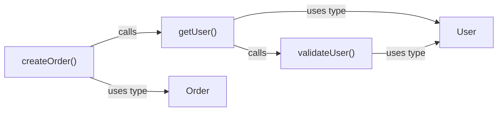

# Shared Types

**File:** `src/db/types.ts`

These types are used across all modules.

---

## Node Types

```typescript
export type NodeType =
  | 'Function'
  | 'Class'
  | 'Method'
  | 'Interface'
  | 'TypeAlias'
  | 'Variable'
  | 'File'
  | 'Property';
```

| Type | Description |
|------|-------------|
| `Function` | Standalone function declaration or expression |
| `Class` | Class declaration |
| `Method` | Method inside a class |
| `Interface` | TypeScript interface |
| `TypeAlias` | Type alias (`type Foo = ...`) |
| `Variable` | Variable or constant declaration |
| `File` | Source file node |
| `Property` | Property of interface/class/object |

---

## Edge Types

```typescript
export type EdgeType =
  | 'CALLS'
  | 'IMPORTS'
  | 'CONTAINS'
  | 'IMPLEMENTS'
  | 'EXTENDS'
  | 'USES_TYPE'
  | 'READS_PROPERTY'
  | 'WRITES_PROPERTY';
```

| Type | From | To | Description |
|------|------|-----|-------------|
| `CALLS` | Function/Method | Function/Method | Function call |
| `IMPORTS` | File | File | Import statement |
| `CONTAINS` | File/Class | Function/Method/Property | Containment |
| `IMPLEMENTS` | Class | Interface | Class implements interface |
| `EXTENDS` | Class/Interface | Class/Interface | Inheritance |
| `USES_TYPE` | Function/Method/Variable | Interface/TypeAlias/Class | Type usage |
| `READS_PROPERTY` | Function/Method | Property | Property read access |
| `WRITES_PROPERTY` | Function/Method | Property | Property write access |

---

## Base Node

All nodes share these properties:

```typescript
interface BaseNode {
  /** Unique ID: "{relativePath}:{symbolPath}" e.g., "src/utils.ts:formatDate" */
  id: string;

  /** Node type discriminator */
  type: NodeType;

  /** Symbol name (e.g., "formatDate", "User") */
  name: string;

  /** Module name from config */
  module: string;

  /** Package name from config */
  package: string;

  /** Relative file path */
  filePath: string;

  /** Start line number (1-indexed) */
  startLine: number;

  /** End line number (1-indexed) */
  endLine: number;

  /** Whether exported from module */
  exported: boolean;
}
```

---

## Node Variants (Discriminated Union)

```typescript
export interface FunctionNode extends BaseNode {
  type: 'Function';
  parameters?: Array<{ name: string; type?: string }>;
  returnType?: string;
  async?: boolean;
}

export interface ClassNode extends BaseNode {
  type: 'Class';
  extends?: string;      // Parent class ID
  implements?: string[]; // Interface IDs
}

export interface MethodNode extends BaseNode {
  type: 'Method';
  parameters?: Array<{ name: string; type?: string }>;
  returnType?: string;
  async?: boolean;
  visibility?: 'public' | 'private' | 'protected';
  static?: boolean;
}

export interface InterfaceNode extends BaseNode {
  type: 'Interface';
  extends?: string[]; // Extended interface IDs
}

export interface TypeAliasNode extends BaseNode {
  type: 'TypeAlias';
  aliasedType?: string; // String representation of the type
}

export interface VariableNode extends BaseNode {
  type: 'Variable';
  variableType?: string;
  isConst?: boolean;
}

export interface FileNode extends BaseNode {
  type: 'File';
  extension?: string; // e.g., ".ts", ".tsx"
}

export interface PropertyNode extends BaseNode {
  type: 'Property';
  propertyType?: string;
  optional?: boolean;
  readonly?: boolean;
}

export type Node =
  | FunctionNode
  | ClassNode
  | MethodNode
  | InterfaceNode
  | TypeAliasNode
  | VariableNode
  | FileNode
  | PropertyNode;
```

---

## Edge

```typescript
export interface Edge {
  /** Source node ID */
  source: string;

  /** Target node ID */
  target: string;

  /** Edge type */
  type: EdgeType;

  /** Rich metadata (varies by edge type) */

  // CALLS edges
  callCount?: number;

  // IMPORTS edges
  isTypeOnly?: boolean;
  importedSymbols?: string[];

  // USES_TYPE edges
  context?: 'parameter' | 'return' | 'property' | 'variable';
}
```

---

## Path

```typescript
export interface Path {
  /** Starting node ID */
  start: string;

  /** Ending node ID */
  end: string;

  /** Ordered node IDs (including start and end) */
  nodes: string[];

  /** Ordered edges connecting the nodes */
  edges: Edge[];

  /** Path length (number of edges) */
  length: number;
}
```

---

## Search and Traversal Options

```typescript
export interface SearchFilters {
  /** Filter by node type(s) */
  nodeType?: NodeType | NodeType[];

  /** Filter by module name(s) */
  module?: string | string[];

  /** Filter by package name(s) */
  package?: string | string[];

  /** Filter by export status */
  exported?: boolean;
}

export interface TraversalOptions {
  /** Maximum traversal depth */
  maxDepth?: number;

  /** Filter by module name(s) */
  moduleFilter?: string[];

  /** Filter by edge type(s) */
  edgeTypes?: EdgeType[];
}

export type TraversalDirection = 'outgoing' | 'incoming' | 'both';

export interface NeighborOptions {
  /** Maximum distance from center node (number of edges) */
  distance: number;

  /** Direction to traverse edges */
  direction?: TraversalDirection; // default: 'both'

  /** Filter by edge type(s). If omitted, all edge types are traversed */
  edgeTypes?: EdgeType[];
}
```

---

## Subgraph

Represents a subset of the full graph, typically returned by neighborhood queries.

```typescript
export interface Subgraph {
  /** The center node of this subgraph */
  center: Node;

  /** All nodes in the subgraph (including center) */
  nodes: Node[];

  /** All edges connecting nodes in the subgraph */
  edges: Edge[];
}
```

---

## Mermaid Conversion

**File:** `src/db/SubgraphToMermaid.ts`

```typescript
export interface MermaidOptions {
  /** Graph direction: 'LR' (left-right) or 'TD' (top-down). Default: 'LR' */
  direction?: 'LR' | 'TD';
}

/**
 * Convert a Subgraph to Mermaid flowchart syntax.
 *
 * Output format:
 * - Functions/Methods: myFunction()
 * - Other nodes: just the name (User, Order, etc.)
 * - Edge labels: lowercase, human readable (calls, imports, uses type)
 *
 * @param subgraph - The subgraph to convert
 * @param options - Mermaid rendering options
 * @returns Mermaid flowchart string
 */
export const subgraphToMermaid = (
  subgraph: Subgraph,
  options?: MermaidOptions
): string;
```

### Mermaid Output Example

```typescript
import { subgraphToMermaid } from './SubgraphToMermaid';

const subgraph = await reader.findNeighbors('src/order.ts:createOrder', {
  distance: 2,
  direction: 'both',
  edgeTypes: ['CALLS', 'USES_TYPE']
});

console.log(subgraphToMermaid(subgraph, { direction: 'LR' }));
```

Output:


### Node ID Generation

Mermaid node IDs are generated as `n0`, `n1`, etc. to avoid escaping issues. The actual content is in quoted labels.

---

## subgraphToMermaid Unit Tests

**File:** `tests/db/unit/SubgraphToMermaid.test.ts`

### Test Cases

#### Node Formatting
| Test | Input | Expected Output |
|------|-------|-----------------|
| Function node | `{ type: 'Function', name: 'createOrder' }` | `createOrder()` |
| Method node | `{ type: 'Method', name: 'validate' }` | `validate()` |
| Class node | `{ type: 'Class', name: 'UserService' }` | `UserService` |
| Interface node | `{ type: 'Interface', name: 'User' }` | `User` |
| TypeAlias node | `{ type: 'TypeAlias', name: 'UserId' }` | `UserId` |
| Variable node | `{ type: 'Variable', name: 'config' }` | `config` |
| File node | `{ type: 'File', name: 'utils.ts' }` | `utils.ts` |
| Property node | `{ type: 'Property', name: 'email' }` | `email` |

#### Edge Label Formatting
| Test | Input | Expected Output |
|------|-------|-----------------|
| CALLS | `{ type: 'CALLS' }` | `calls` |
| IMPORTS | `{ type: 'IMPORTS' }` | `imports` |
| CONTAINS | `{ type: 'CONTAINS' }` | `contains` |
| IMPLEMENTS | `{ type: 'IMPLEMENTS' }` | `implements` |
| EXTENDS | `{ type: 'EXTENDS' }` | `extends` |
| USES_TYPE | `{ type: 'USES_TYPE' }` | `uses type` |
| READS_PROPERTY | `{ type: 'READS_PROPERTY' }` | `reads` |
| WRITES_PROPERTY | `{ type: 'WRITES_PROPERTY' }` | `writes` |

#### Graph Direction
| Test | Input | Expected First Line |
|------|-------|---------------------|
| Left-to-right | `toMermaid('LR')` | `graph LR` |
| Top-down | `toMermaid('TD')` | `graph TD` |
| Default (no arg) | `toMermaid()` | `graph LR` |

#### Empty and Minimal Graphs
| Test | Description |
|------|-------------|
| Empty subgraph | Center node only, no neighbors → outputs just center node |
| Single edge | Center + one neighbor + one edge |
| No edges | Multiple nodes but no edges connecting them |

#### Complete Graph Structure
```typescript
// Test: Full graph with mixed node types and edges
const subgraph = createSubgraph({
  center: functionNode('handleRequest'),
  nodes: [
    functionNode('handleRequest'),
    functionNode('validateInput'),
    interfaceNode('Request'),
    classNode('Logger')
  ],
  edges: [
    { source: 'handleRequest', target: 'validateInput', type: 'CALLS' },
    { source: 'handleRequest', target: 'Request', type: 'USES_TYPE' },
    { source: 'handleRequest', target: 'Logger', type: 'CALLS' }
  ]
});

// Expected output structure:
// graph LR
//   n0["handleRequest()"]
//   n1["validateInput()"]
//   n2["Request"]
//   n3["Logger"]
//   n0 -->|calls| n1
//   n0 -->|uses type| n2
//   n0 -->|calls| n3
```

---

## Index Result

```typescript
export interface IndexResult {
  /** Number of files processed */
  filesProcessed: number;

  /** Number of nodes added */
  nodesAdded: number;

  /** Number of edges added */
  edgesAdded: number;

  /** Duration in milliseconds */
  durationMs: number;

  /** Errors encountered (non-fatal) */
  errors?: Array<{
    file: string;
    message: string;
  }>;
}
```
