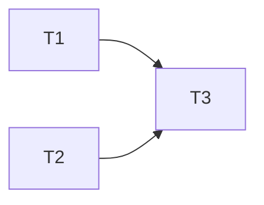

# Specs Directory

This directory contains the project specifications, organized by feature.

**Fundamental rule: always keep spec files up to date.** When a spec is
implemented, remove it from TODO and add the `@spec` reference (JSDoc) in the
code.

**Before starting work on a feature**, check if a `*.plan.md` file exists next
to the corresponding `*.feature.md`. If so, read it first — it contains the
implementation plan, progress tracking, and architecture decisions from previous
sessions.

## Philosophy

Specs describe the system as a **black box**. They are **behavior-oriented**:
inputs, outputs, observable effects. No breakdown by technical component or
source file.

- **System level**: specs describe what the system does, not how the code is
  organized
- **Inputs / outputs**: each spec must be verifiable through its observable
  inputs and outputs
- **Optional technical details**: a spec may mention technical constraints
  (storage format, algorithm, protocol) when they are part of the observable
  behavior — but these details are not tied to a specific component or file
- **Not a mirror of code**: the spec hierarchy reflects functional domains, not
  the `src/` directory tree

## Definitions

### Spec

A **spec** is a verifiable assertion about the system's behavior. It is
identified by a **unique ID** placed as a markdown anchor.

To decide whether something deserves an ID: _can you attach a `@spec` to a
named declaration in the implementation code?_ If yes, it's a spec. If not, it's
context — write it as prose without an ID. Every spec ID implies a contract: it
**must** appear as `@spec` in at least one implementation file.

### Feature

A **feature** is a cohesive group of specs, described in one or more
`*.feature.md` files. Each feature is identified by a **unique ID** (e.g.,
`tool`, `search.semantic`), used as a prefix in all its spec IDs. This ID must
be unique across the entire `specs/` directory. Multiple features can coexist in
the same folder.

By convention, IDs use dot-separated prefixes for sub-features (`search.semantic`,
`search.lexical`) to avoid collisions.

## Workflow

**Mandatory modification order:** NEVER add a constraint to the plan or code
that is not explicit in the specs. Always modify in this order:

- **specs -> plan** (the plan derives from specs, never the other way around)
- **specs -> tests -> implementation code** (code implements specs, not the other
  way around)

1. **Write the specs** in a feature file with anchored IDs
2. **Write the tests** that reference spec IDs via `/** @spec */` JSDoc
3. **Implement the code** that references spec IDs via `/** @spec */` and make
   the tests pass
4. **Update the TODO** of the feature file (remove implemented specs)

## Feature

### Feature files

A feature is described by one or more `*.feature.md` files:

- Main file: `{feature}.feature.md` (e.g., `tool.feature.md`)
- Supplementary file: `{feature}.{topic}.feature.md` (e.g.,
  `tool.output.feature.md`)

Each `*.feature.md` file declares the feature ID. All files for the same feature
must declare the same ID. Multiple features can coexist in the same folder.

### Required header

Each feature file declares its ID and status:

```markdown
# searchGraph Tool

**Status:** 🚧 In progress

**ID:** `tool`
```

### Status

| Status            | Emoji | Description                              |
| ----------------- | ----- | ---------------------------------------- |
| Design            | 📝    | Specs being drafted                      |
| Ready to develop  | 🚀    | Specs validated, development can start   |
| In progress       | 🚧    | Development in progress                  |
| Implemented       | ✅    | Feature completed                        |

### TODO

Lists **only unimplemented specs**. Each item contains:

1. A **clickable link** to the section (auto-generated anchor by VS Code)
2. A **Pandoc citation** `[@spec-id]` to the spec ID

```markdown
## TODO

- [Forward traversal](#forward-traversal) `[@tool::forward-traversal]`
```

- No checkboxes — the list only contains what remains to be done
- If a spec is not in TODO, it is considered **implemented**
- An implemented spec **must** be referenced in the code (tests or `@spec`)
- The TODO section is removed when the status changes to ✅
- Never add "✅ Implemented" markers in the body of specs

**Status / TODO consistency:**

- Status 🚧 or 🚀 -> the TODO section **must** be present (otherwise switch to ✅)
- Status ✅ -> the TODO section **must not** be present

### Content: no duplication

**Single source of truth per spec.** Do not repeat information as a summary or
synthesis table.

Only document specs **specific to the feature**. If a behavior is shared across
features, document it in the parent feature or a context file.

### Forbidden content

**Never** include estimation, complexity, or effort sections in spec files
(tables like "Complexity / Effort / Total"). Specs describe the **what**, not
the **how long**.

## Spec

### ID format

```
{feature-id}::{descriptive-path}
```

- `::` separates the feature ID from the spec's descriptive path
- Dots (`.`) separate hierarchical levels (in both the feature ID and the path)
- Hyphens (`-`) within a level for compound names
- Lowercase, descriptive, not numbered

Examples: `tool::forward-traversal`,
`graph-model::edges.generic-unwrapping`

### Declaring a spec

The spec ID is placed **below** the heading, not above it. The `{#...}` on a
heading interferes with VS Code's anchor generation and prevents `[text](#slug)`
links from working.

```markdown
### Forward traversal

> `{#tool::forward-traversal}`

Given `{ from: { symbol: "X" } }`, the tool returns all transitive dependencies
of X.
```

## Linking code to specs

### From tests

Use `@spec` in JSDoc on `describe` or `it` blocks:

```typescript
/** @spec tool::forward-traversal */
describe("forward traversal", () => {
  it("returns transitive dependencies", () => {
    // all tests in the describe inherit the @spec
  });

  it("stops at max_nodes limit", () => {
    // ...
  });
});
```

If a `describe` contains tests linked to **different specs**, place the `@spec`
on each `it` individually:

```typescript
describe('symbol resolution', () => {
  /** @spec tool::exact-match */
  it('resolves exact symbol name', () => { ... });

  /** @spec tool::method-fallback */
  it('falls back to method name search', () => { ... });
});
```

Resolution rules: the closest `@spec` wins. A `@spec` on an `it` overrides the
one on the parent `describe`.

A spec can be referenced in **one or more tests**.

### From implementation code

⚠️ Each implemented spec ID must be referenced at least once in the
implementation code (excluding tests)

```typescript
/** @spec graph-model::edges.generic-unwrapping */
const innerType = extractGenericInner(typeText);
```

When a `@spec` is on a **top-level function or variable** that is the primary
implementation of the spec, it **must** be paired with an `@example`:

```typescript
/**
 * @spec graph-model::edges.generic-unwrapping
 * @example
 * extractGenericInner("Promise<User>") // "User"
 */
const extractGenericInner = (typeText: string): string | null => { ... };
```

`@example` is not required on `@spec` annotations inside function bodies or on
expression statements — the surrounding code is the example.

> **Placement — `@spec` on declarations and expression statements**
>
> A `@spec` can be placed on any node that TypeScript attaches JSDoc to:
>
> - **Named declarations** (variable, function, class, interface, enum, method)
> - **Expression statements** (e.g., `app.get(...)`, `router.post(...)`)
>
> Forbidden: **control flow statements** (`if`, `for`, `return`, `switch`).
>
> The `@spec` is attributed to the **enclosing graph node** (the nearest
> function, method, or class). Placing `@spec` deep inside a function body pins
> the spec to the exact line of logic, while the graph indexes it on the
> enclosing node.
>
> ```typescript
> // ✅ On a top-level function
> /** @spec indexing::re-export-transparency */
> const followAliasChain = (symbol: Symbol): Symbol => { ... };
>
> // ✅ On a local declaration inside a function body
> const indexFile = (file: SourceFile) => {
>   /** @spec indexing::re-export-transparency */
>   const resolvedTarget = followAliasChain(symbol);
> }
>
> // ✅ On an expression statement inside a function body
> const startServer = () => {
>   /** @spec server::api.health */
>   app.get("/health", (_req, res) => { res.json({ status: "ok" }); });
> }
>
> // ❌ FORBIDDEN — control flow statement
> /** @spec indexing::re-export-transparency */
> if (isReExport(symbol)) { ... }
> ```

### Coverage

**Implementation (mandatory):** Every spec ID must be referenced (`@spec`) in at
least one named declaration in the implementation code. A spec ID that does not
appear in any implementation file is **not implemented** — it belongs in the
feature's TODO section.

**Tests (expected):** Every spec ID should also be referenced in at least one
test (`describe` or `it`). Some specs are enforced at the type level or require
integration-only verification — these may lack a dedicated test reference, but
this is the exception, not the norm.

**Unreferenced IDs:** A spec ID with no `@spec` reference anywhere in the
codebase and absent from TODO is an anomaly. Either add the reference, move it
to TODO, or demote it to context (remove the ID).

### Cross-feature references

To reference a spec or a feature from a feature file, use the Pandoc citation
syntax `[@id]`:

```markdown
### Topic search

> `{#tool::topic-search}`

Given `{ topic: "validation" }`, the tool performs a hybrid search
`[@search.hybrid]` and returns matching symbols with scores.
```

- `[@search.hybrid]` — references a spec from another feature
- `[@search]` — references an entire feature

`[@id]` references in body text must be formatted as **inline code** (backticks)
to visually distinguish them from surrounding text.

## Directory structure

The hierarchy reflects behavioral domains, not the source code structure:

```
specs/
  indexing/
    indexing.feature.md                   # ID: indexing
  search/
    search.feature.md                     # ID: search (shared concepts)
    semantic/
      semantic.feature.md                 # ID: search.semantic
    lexical/
      lexical.feature.md                  # ID: search.lexical
    hybrid/
      hybrid.feature.md                   # ID: search.hybrid
  tool/
    tool.feature.md                       # ID: tool
  graph-model/
    graph-model.feature.md                # ID: graph-model
  server/
    server.feature.md                     # ID: server
  configuration/
    configuration.feature.md              # ID: configuration
```

### Context files

Directories can contain `*.context.md` files to document shared context between
multiple features (e.g., `search.context.md`). These files are **pure
documentation**: no specs, no TODO.

Each context file declares an ID. Feature IDs and context IDs share the same
namespace: they must all be unique across the entire `specs/` directory.

```markdown
# Search

**ID:** `search-context`
```

Features can reference it with `[@search-context]`.

### Plan files

`*.plan.md` files are **local working documents** (gitignored) used to plan the
implementation of a feature. They are placed next to the corresponding feature
file. Useful for multi-step features (migrations, multiple endpoints, frontend +
backend). For a simple spec with a straightforward implementation, the feature
file's TODO is sufficient.

```
specs/
  search/
    hybrid/
      hybrid.feature.md         # Source of truth (committed)
      hybrid.plan.md            # Implementation plan (gitignored)
```

**Typical content:**

- Atomic tasks with verification criteria (see below)
- Task dependency graph (Mermaid)
- Human review checkpoints at strategic points
- Architecture decisions (see below)
- Working notes, open questions

**Architecture decisions:**

The plan can contain a "Decisions" section for technical choices debated during
development. These decisions document the **why** of a choice (the spec
documents the **what**).

```markdown
## Decisions

- BM25 weight 40%, vector weight 60% — vector catches semantic matches that
  lexical misses, but BM25 ensures exact name matches rank high
- Orama chosen over raw SQLite FTS5 — provides both BM25 and vector search in
  a single index with minimal setup
```

During implementation, transfer relevant decisions as JSDoc on the code they
affect. When the plan is deleted, decisions survive in the code.

**Tasks:**

The plan breaks work down into **atomic tasks** that can be accomplished
independently (by an agent or a developer). Each task has a short ID, a
description, and a verification criterion:

```markdown
## Tasks

### T1 — Implement BM25 preprocessing

Split camelCase identifiers before indexing. Verify: "validateCart" matches
query "validate".

### T2 — Implement vector search `[@search.semantic]`

Generate embeddings at index time, store in Orama. Verify: conceptual queries
return semantically related symbols.

### T3 — Combine scores `[@search.hybrid]`

Weighted combination of BM25 + vector scores. Verify: exact name matches rank
above semantic-only matches.
```

**Dependency graph:**

A Mermaid diagram makes dependencies between tasks explicit — readable by both
humans and AI. Tasks without a direct dependency link can be parallelized.

````markdown
## Dependencies


````

**Checkpoints (Human-in-the-loop):**

Checkpoints are control points where a human verifies that work is on the right
track. Their placement is strategic:

- **Strongly recommended** at **split points** — where a completed task triggers
  multiple parallel tasks. An error at this stage propagates to all downstream
  branches (multiplier effect).
- **Recommended** at **convergence points** — where multiple parallel branches
  rejoin — depending on graph structure and upstream task complexity.
- **Case by case** after complex, subtle, or fragile tasks, regardless of their
  position in the graph (e.g., data migrations, delicate algorithms).

```markdown
## Checkpoints

🔍 **After T1+T2** (convergence -> T3): Verify that BM25 and vector search
work independently before combining scores.
```

The priority is to detect drift as early as possible.

**Rules:**

- Ephemeral: must be deleted once the plan is finished (all its tasks completed),
  even if the associated feature still has specs in TODO
- **No specs** in plans (no `{#...}` IDs) — specs live exclusively in
  `*.feature.md`
- **One-way dependency**: a plan can reference specs and features via
  `[@spec-id]`, but a feature file must **never** reference a plan
- **Never** add a constraint to the plan that is not explicit in the specs — the
  plan organizes the work, specs define the behavior
- Technical decisions -> transfer as JSDoc on the relevant code during
  implementation (with `@spec`)
