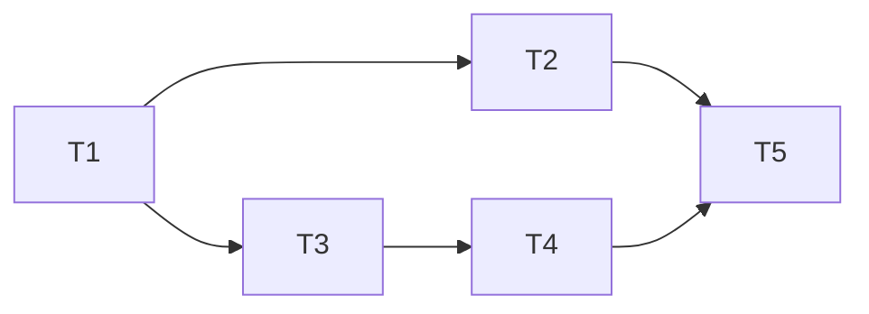

# Server UI — Topic/Endpoint Mutual Exclusivity

Implementation plan for `[@server::ui.topic-endpoint-exclusivity]`.

## Decisions

- Active mode tracked as state field (`activeSection: "topic" | "graph" | null`)
  rather than derived from input values — avoids ambiguity when both sections
  have values but only one should drive the query.
- `submittedTopic` is no longer needed as a separate field. Topic is submitted
  when the topic section is active and `topicInput` is non-empty. The Search
  button and Enter key just activate the topic section.
- The `queryResult` loader uses `activeSection` to decide which API call to
  make, ignoring the inactive section's values entirely.

## Tasks

### T1 — Add `activeSection` state field

Add `activeSection: "topic" | "graph" | null` to `AppState` in
`appVertexConfig.ts`, initial value `null`. Update reducers:

- `setTopicInput` → sets `activeSection` to `"topic"`
- `submitTopic` → sets `activeSection` to `"topic"`
- `setFromEndpoint`, `setToEndpoint`, `setFromSearchQuery`, `setToSearchQuery`
  → set `activeSection` to `"graph"` (only when value is non-empty/non-null)

Remove `submittedTopic` field — replace with `topicInput` + `activeSection`.

Verify: unit test in `appVertexConfig.test.ts` — dispatching `setTopicInput`
sets `activeSection` to `"topic"`, dispatching `setFromEndpoint` sets it to
`"graph"`.

### T2 — Update `queryResult` loader

Change the `queryResult` loader in `appVertexConfig.ts` to branch on
`activeSection` instead of checking which fields are populated:

- `activeSection === "topic"` and `topicInput.trim()` → `searchByTopic`
- `activeSection === "graph"` → `searchGraph` with from/to
- `activeSection === null` → `of(null)`

Add `activeSection` to the `loadFromFields$` dependency list.

Verify: unit test — setting topic + from endpoint, then activating topic section
→ query uses topic, not from.

### T3 — Visual sections in `App.tsx`

Wrap topic input in a `<section>` with rounded border. Wrap FROM/TO selectors in
a separate `<section>` with rounded border. Both get a CSS class/style driven by
`activeSection`:

- `null` → both sections muted border
- `"topic"` → topic section accent border, graph section muted border
- `"graph"` → graph section accent border, topic section muted border

Verify: visual — load page, both sections have muted border. Type in topic →
topic section highlights. Click FROM selector → graph section highlights.

### T4 — Wire `activeSection` to React

Pass `activeSection` from vertex state to `MainContent` in `App.tsx`. Use it to
compute border styles for both sections. No need to disable inputs — all remain
interactive.

Verify: visual — both sections always interactive. Typing in inactive section
activates it and deactivates the other.

### T5 — Add `@spec` annotations + cleanup

Add `@spec server::ui.topic-endpoint-exclusivity` to the `activeSection`
reducer logic. Add `@spec` annotations for all other new UI spec IDs
(`server::ui.query-patterns`, `server::ui.endpoint-types`, etc.) to their
respective implementation locations.

Remove `"md"` from `OutputFormat` type (dead code found during analysis).

Verify: `npm run check` passes. All new spec IDs referenced in code.

## Dependencies

## Checkpoints

After T1+T2: verify state logic is correct before touching React components.
After T4: visual check in browser before adding annotations.
